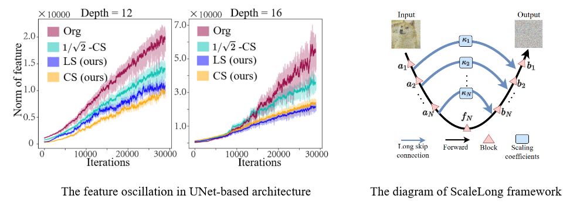
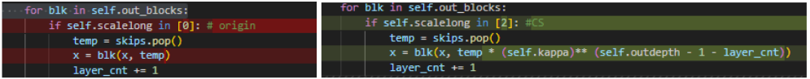
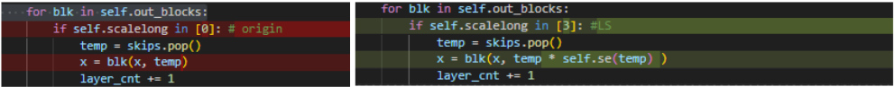

## ScaleLong 🐉 <br> <sub><small>Official PyTorch implementation of our paper:<br> "ScaleLong: Towards More Stable Training of Diffusion Model via Scaling Network Long Skip Connection" (NeurIPS 2023)</small></sub>


💡ScaleLong [(paper link)](https://arxiv.org/abs/2310.13545) is a simple yet effective method that can stabilize the training of UNet-based models for diffusion model (potentially including other tasks that utilize UNet, such as medical segmentation, image segmentation, image-to-image translation, and more). Its core concept involves applying regular or adaptive scaling to the long skip connections of the UNet architecture.




ScaleLong is highly straightforward to implement. Specifically, as depicted in the diagram below, the main focus lies on the file `libs/uvit.py`.

1. Original UNet vs $1/\sqrt{2}$-CS:


2. Original UNet vs CS:


3. Original UNet vs LS:


where the $1/\sqrt{2}$-CS is a magical technology that has been widely applied to some well-known diffusion models, including Imagen, SR3, Score-based generative modeling by SDE, as well as some GAN-based generative models, such as ProgressiveGAN, StyleGAN, and StyleGAN-2.


## Dependency

```sh
pip install torch torchvision --extra-index-url https://download.pytorch.org/whl/cu116  # install torch-1.13.1
pip install accelerate==0.12.0 absl-py ml_collections einops wandb ftfy==6.1.1 transformers==4.23.1

# xformers is optional, but it would greatly speed up the attention computation.
pip install -U xformers
pip install -U --pre triton
```

* This repo is based on [`timm==0.3.2`](https://github.com/rwightman/pytorch-image-models), for which a [fix](https://github.com/rwightman/pytorch-image-models/issues/420#issuecomment-776459842) is needed to work with PyTorch 1.8.1+. (Perhaps other versions also work, but I haven't tested it.)
* We highly suggest install [xformers](https://github.com/facebookresearch/xformers), which would greatly speed up the attention computation for *both training and inference*.


## Preparation Before Training

#### Autoencoder
Download `stable-diffusion` directory from this [link](https://drive.google.com/drive/folders/1yo-XhqbPue3rp5P57j6QbA5QZx6KybvP?usp=sharing) (which contains image autoencoders converted from [Stable Diffusion](https://github.com/CompVis/stable-diffusion)). 
Put the downloaded directory as `assets/stable-diffusion` in this codebase.
The autoencoders are used in latent diffusion models.


#### Reference statistics for FID
Download `fid_stats` directory from this [link](https://drive.google.com/drive/folders/1yo-XhqbPue3rp5P57j6QbA5QZx6KybvP?usp=sharing) (which contains reference statistics for FID).
Put the downloaded directory as `assets/fid_stats` in this codebase.
In addition to evaluation, these reference statistics are used to monitor FID during the training process.

## Training


The following is the training command or you can run `run.py`:
```sh
export CUDA_VISIBLE_DEVICES=0
            # assign a gpu
accelerate launch --multi_gpu --num_processes 1 --mixed_precision fp16 --main_process_port 1024 train.py\
                  --config=cifar10_config.py --config.nnet.scalelong=0 --config.nnet.kappa=0.5\
                  --config.train.batch_size=64
            # num_processes: the number of gpu
            # config: training/model config
            # config.nnet.scalelong: method for scaling the long skip connection
                      # 0:    'orgin'
                      # 1:    '1/sqrt(2)-CS'
                      # 2:    'CS'
                      # 3:    'LS'
                      # 4:    'LS (non-share)'
            # config.nnet.kappa: the scaling coefficient for CS (we suggest kappa in [0.5, 0.95])
            # config.train.batch_size: batch size

```


## References
If you find the code useful for your research, please consider citing
 ```bib
@inproceedings{huang2022scale,
  title={ScaleLong: Towards More Stable Training of Diffusion Model via Scaling Network Long Skip Connection},
  author={Huang, Zhongzhan and Pan, Zhou and Yan, Shuicheng and Lin, Liang},
  booktitle = {NeurIPS},
  year={2023}
}
```

This implementation is based on
* [UViT](https://github.com/baofff/U-ViT/tree/main) ( a novel UNet-based architecture for image generation )
